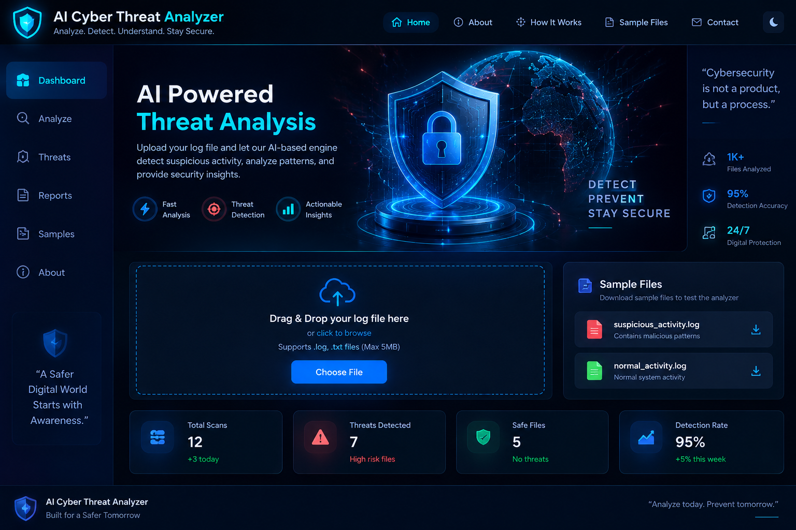
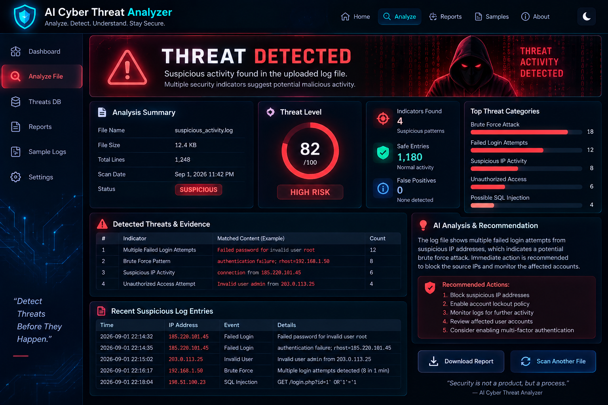
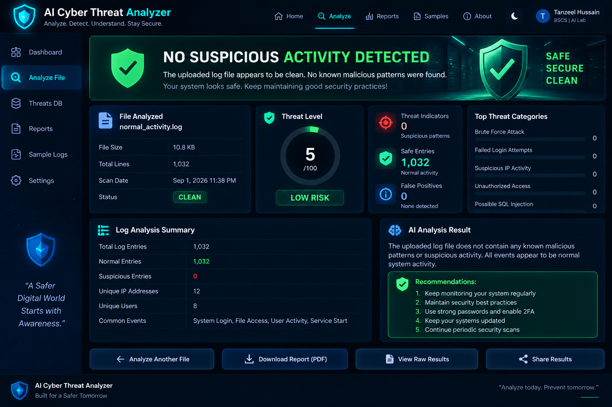

<div align="center">

# 🛡️ AI Cyber Threat Analyzer

### Detect Suspicious Activity • Analyze Security Logs • Understand Cyber Threats

An interactive cybersecurity threat-analysis web application that analyzes `.log` and `.txt` files, detects suspicious activity, calculates a risk score, highlights matched evidence, and provides security recommendations directly inside the browser.

[](https://tanzeel0hussain.github.io/AI-Cyber-Threat-Analyzer/)
[](https://github.com/Tanzeel0Hussain/AI-Cyber-Threat-Analyzer)


**Companion Project for**

## AI in Cybersecurity: Detecting and Preventing Cyber Attacks

</div>

---

## 🌐 Live Cybersecurity Demo

The project is deployed using **GitHub Pages** and can be tested directly from a web browser.

### 🚀 [Launch AI Cyber Threat Analyzer](https://tanzeel0hussain.github.io/AI-Cyber-Threat-Analyzer/)

No installation, backend server, database, or API key is required.

---

# 📸 Project Preview

## 🖥️ Cybersecurity Dashboard



## 🚨 Suspicious Activity Detection

The analyzer can display a risk score, threat level, matched indicators, evidence, category breakdown, and a security recommendation.



## ✅ Safe Activity Result

When no configured suspicious indicators are found, the analyzer reports the log as safe/low risk.



---

# 🎯 Project Objective

Cybersecurity systems generate large amounts of log data containing authentication attempts, network activity, system events, and possible attacks. This project demonstrates how automated security analysis can inspect those logs and turn suspicious patterns into understandable threat information.

```text
Security Log
     ↓
Read Log Data
     ↓
Analyze Security Events
     ↓
Match Threat Indicators
     ↓
Calculate Risk Score
     ↓
Identify Threat Level
     ↓
Display Evidence
     ↓
Generate Security Recommendation
```

---

# ✨ Main Features

- Drag-and-drop `.log` and `.txt` file analysis
- Browser-side threat scanning
- Risk score from **0–100**
- Threat levels: Minimal, Low, Medium, High, Critical
- Matched security evidence
- Threat-category breakdown
- Security recommendations
- Two downloadable demo log files
- Privacy-friendly local file processing
- Responsive dark cyber interface
- GitHub Pages deployment with no backend required

---

# 🚨 Threat Indicators

| Security Indicator | Purpose |
|---|---|
| 🔐 Failed Login | Detect failed authentication attempts |
| ⚡ Brute Force | Identify repeated login attacks |
| ⛔ Unauthorized Access | Detect access violations |
| 💉 SQL Injection | Identify SQL injection indicators |
| 🌐 Suspicious IP Activity | Highlight suspicious network activity |
| 🔎 Port Scanning | Detect reconnaissance behavior |
| 🦠 Malware Indicators | Identify malware-related patterns |
| 🔒 Ransomware Indicators | Detect ransomware-related activity |
| 👑 Privilege Escalation | Identify suspicious privilege changes |
| 📡 DoS / DDoS | Detect denial-of-service indicators |
| 📤 Data Exfiltration | Identify possible unauthorized data transfer |
| 🎣 Phishing Indicators | Detect phishing-related patterns |

---

# 🧠 How the Detection Engine Works

This version uses a transparent **rule-based cybersecurity threat-scoring engine**.

```text
Uploaded File
      ↓
Browser File API
      ↓
Threat Rules
      ↓
Pattern Matching
      ↓
Severity Weighting
      ↓
Risk Calculation
      ↓
Threat Report
```

Each security detection rule can contain a threat name, category, suspicious patterns, severity, and weighted score. Repeated suspicious events can increase the overall risk score.

---

# 🎬 Live Classroom Demo

## 🚨 Suspicious Log

File: `samples/suspicious_activity.log`

```text
Download suspicious_activity.log
            ↓
Upload to Analyzer
            ↓
Click "Analyze Threats"
            ↓
Suspicious Activity Detected
            ↓
Show Risk Score + Indicators + Evidence + Recommendation
```

## ✅ Normal Log

File: `samples/normal_activity.log`

```text
Download normal_activity.log
          ↓
Upload to Analyzer
          ↓
Analyze Threats
          ↓
No Suspicious Activity Detected
```

---

# 📊 Presentation

This project accompanies the presentation:

## **AI in Cybersecurity: Detecting and Preventing Cyber Attacks**

### 📥 [Download PowerPoint Presentation](presentation/AI_in_Cybersecurity.pptx)

Presentation file: `presentation/AI_in_Cybersecurity.pptx`

---

# 🛠️ Technologies Used

| Technology | Purpose |
|---|---|
| HTML5 | Web application structure |
| CSS3 | Cybersecurity dashboard design |
| JavaScript | Threat-analysis logic |
| Browser File API | Local log-file processing |
| GitHub | Source-code hosting |
| GitHub Pages | Live web deployment |

---

# 📁 Project Structure

```text
AI-Cyber-Threat-Analyzer/
│
├── index.html
├── README.md
├── LICENSE
├── .nojekyll
│
├── css/
│   └── style.css
│
├── js/
│   ├── app.js
│   ├── analyzer.js
│   ├── dashboard.js
│   ├── file-handler.js
│   └── threat-rules.js
│
├── samples/
│   ├── suspicious_activity.log
│   └── normal_activity.log
│
├── screenshots/
│   ├── dashboard.png
│   ├── threat-detected.png
│   └── safe-result.png
│
├── presentation/
│   ├── AI_in_Cybersecurity.pptx
│   └── README.md
│
└── docs/
    ├── PROJECT_OVERVIEW.md
    ├── DETECTION_RULES.md
    └── DEMO_GUIDE.md
```

---

# 🚀 Run the Project

### Option 1 — Live Website

[Open Live Demo](https://tanzeel0hussain.github.io/AI-Cyber-Threat-Analyzer/)

### Option 2 — Run Locally

```bash
git clone https://github.com/Tanzeel0Hussain/AI-Cyber-Threat-Analyzer.git
cd AI-Cyber-Threat-Analyzer
python3 -m http.server 8000
```

Then open `http://localhost:8000`.

---

# 📚 Documentation

- [Project Overview](docs/PROJECT_OVERVIEW.md)
- [Detection Rules](docs/DETECTION_RULES.md)
- [Demo Guide](docs/DEMO_GUIDE.md)

---

# ⚠️ Important Accuracy Note

This project is an **educational cybersecurity demonstration**. The current implementation uses a **rule-based threat detection and scoring engine**, not a trained machine-learning model.

A future version could extend the system with machine learning, anomaly detection, Scikit-learn, intrusion-detection datasets, real-time network monitoring, and threat-intelligence integration.

---

# 👨‍💻 Author

## Tanzeel Hussain

**BS Computer Science**

Cybersecurity • Artificial Intelligence • Ethical Hacking • Software Development

GitHub: [@Tanzeel0Hussain](https://github.com/Tanzeel0Hussain)

---

# 📄 License

This project is available under the **MIT License**. See [LICENSE](LICENSE).

---

<div align="center">

### 🛡️ AI Cyber Threat Analyzer

**Analyze Today • Detect Threats • Prevent Tomorrow**

[🚀 Live Demo](https://tanzeel0hussain.github.io/AI-Cyber-Threat-Analyzer/) •
[📊 Presentation](presentation/AI_in_Cybersecurity.pptx) •
[📚 Documentation](docs/PROJECT_OVERVIEW.md)

</div>
